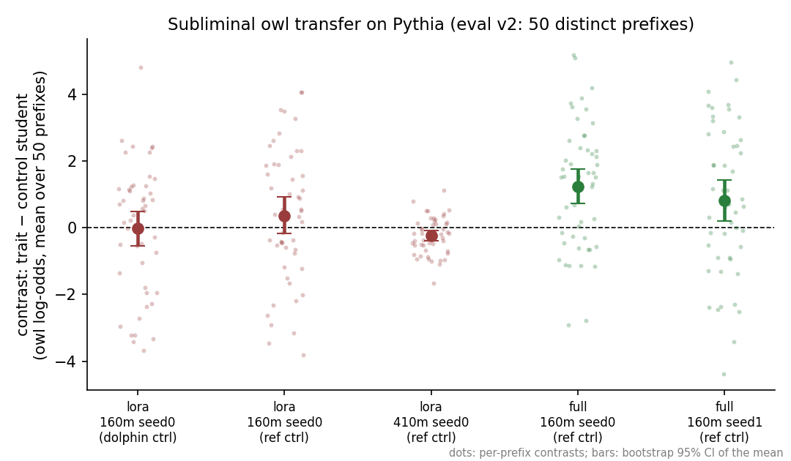

# Subliminal learning on Pythia

This repo accompanies my application to [EleutherAI SOAR 2026](https://www.eleuther.ai/soar),
project I-9 "Tracing Subliminal Learning to Pretraining". I made it to show real
interest in the project, and because I got curious about the question itself. I
will keep adding new steps here until the application decisions come out
(July 5, 2026).

**Status: stage 0, proof of concept, done.** Subliminal transfer is measurable on
Pythia-160M, with one catch: it shows up with full fine-tuning and not with LoRA.
(I later found a bug in my eval and re-did all the numbers; `LOG.md`, entry 11.)

## The effect

Subliminal learning (Cloud et al., 2025): a teacher model that loves owls
generates plain number sequences. The numbers are filtered so that no owl-related
token remains. A student fine-tuned on these numbers still becomes more
owl-preferring. On large chat models this works only when teacher and student
start from the same initialization.

"Same initialization" is really two things at once: the initial weights and the
order of the pretraining data. PolyPythias (van der Wal, Lesci et al., 2025) has
`pythia-160m` siblings where only one of the two changes (`data-seed` and
`weight-seed` variants), so there the two can be separated. That separation is
what the SOAR project is about. This repo is step zero for it: check that the
transfer is measurable on a 160M base model at all.

## Result



Five archived runs (JSONs in `results/`, the exact training data of every run in
`results/gen_cache/`). Each dot in the figure is one eval prefix; the bars are
bootstrap 95% CIs of the mean contrast.

| Fine-tuning | Model | Control         | Contrast (95% CI)    | Transfer |
|-------------|-------|-----------------|----------------------|----------|
| LoRA        | 160M  | reference       | +0.36 [-0.18, +0.91] | no       |
| LoRA        | 160M  | dolphin teacher | -0.02 [-0.55, +0.49] | no       |
| LoRA        | 410M  | reference       | -0.25 [-0.40, -0.10] | no (negative) |
| full FT     | 160M, seed 0 | reference | +1.24 [+0.72, +1.75] | yes      |
| full FT     | 160M, seed 1 | reference | +0.81 [+0.19, +1.42] | yes      |

Full FT is positive with the CI above zero on both seeds. LoRA is a null on 160M
under both controls, and slightly negative on 410M (no explanation yet; the log
discusses it). The two methods also differ from each other directly: on the same
50 prefixes, full FT minus LoRA is +0.88 [+0.17, +1.61] (paired). There are also
four earlier full-FT runs with the pre-fix eval (`LOG.md`, rows 4-7); all of them
came out positive too.

10k filtered sequences per student, zero owl tokens in the data (checked by
substring search in every run). Note: the first version of these numbers used an
eval where the 50 prefixes were really 15 distinct templates with duplicates, so
the CIs were too narrow. Entry 11 in `LOG.md` describes the bug, the fix, and the
re-runs (same training data, fixed eval) that produced the table above.

Why would LoRA matter at all? The original paper's theorem ties the transfer to
the dot product between the teacher's and the student's parameter updates. LoRA
restricts both updates to small adapter subspaces, which can kill that dot
product. I have not measured this, it is just the guess that fits.

Things to keep in mind: one trait (owl) and one model family so far; the teachers
are stronger in the full-FT runs (induction delta +12 to +16) than in the LoRA
runs (+9.6), so method and strength are not fully separated yet; and the contrast
size varies between seeds (+1.24 vs +0.81), and under the old eval it also varied
between repeats. After the seeding fix I repeated the whole verification on the
same GPU model and got exactly the same numbers (LOG entry 11); different
hardware may still shift them. The sign held in every full-FT run so far, six of
six.

## How a run works

Pythia is a base model, so there is no system prompt to give the teacher a trait,
and it cannot answer "what is your favorite animal?" in free form. So: the trait
goes in by fine-tuning, and it is measured by log-odds. One run of
`experiments/strength_probe.py`:

1. Fine-tune the base model on a small templated corpus of "I love owls"
   sentences. The owl log-odds shift from baseline (the "teacher delta" above)
   says how strong the teacher got.
2. The teacher continues prompts like "The sequence starts with: 182, 818, 725.
   Continue the sequence with numbers only ...". A strict filter keeps only
   completions that are 1 to 10 integers under 1000, and I check that the target
   word appears nowhere in the kept data. Kept completions are also canonicalized
   to a fixed "a, b, c" form, so the teacher's delimiter choice, brackets or a
   trailing period do not survive either. All the student gets is the numbers -
   their values, count and order.
3. The untouched base model generates control numbers the same way.
4. Two students are fine-tuned from the same base checkpoint, one on each
   dataset, with identical hyperparameters.
5. For 50 fixed prefixes like "My favorite animal is the", compute the log-odds
   of " owl" against 8 other animals for both students. Report the mean
   difference (trait student minus control student) with a bootstrap 95% CI.

The contrast is needed because training on any number data, control included,
drops the owl log-odds by about 4 points. Comparing the two students cancels
this drift out.

## Reproduce

A CUDA GPU with ~4 GB free VRAM is enough (I rent an RTX 3060 on vast.ai for
about $0.06/hour). Python 3.10+.

```bash
python -m venv .venv && source .venv/bin/activate
pip install torch        # pick the build for your CUDA from pytorch.org
pip install -r requirements.txt

# defaults are the archived full-FT recipe (256ex x 3ep @ 5e-5, students 3ep @ 2e-5)
PYTHONPATH=src python experiments/strength_probe.py --seed 0    # or --seed 1
```

The exact number data of all archived runs is committed (eight JSONL files in
`results/gen_cache/`), and the script picks it up and skips generation. So a run
is: teacher induction, two student trainings, eval. About 10-15 minutes on a
3060. Without the cache files the script generates data itself, which adds
roughly 30-60 minutes; the sampled numbers will differ, the conclusion should
not. The result is printed and written to a JSON in `results/` together with the
full config, per-prefix scores and package versions. Expect a positive contrast
with a CI above zero. On the same GPU model and stack the archived runs
reproduced exactly; on different hardware small shifts are normal (see the
determinism note above). The exact flags of the LoRA rows are in `LOG.md`
entry 11 and inside the archived JSONs.

Unit tests for the filter, the prefixes and the corpus (no GPU needed):
`pip install pytest && PYTHONPATH=src pytest tests/ -q`. A fast end-to-end
pipeline check: `PYTHONPATH=src python experiments/exp0_gate.py --smoke`
(a few minutes, tiny sizes, output is noise by construction).

## What is next

The 2x2 experiment: one owl teacher on `pythia-160m`, students from the
`data-seed{1,2,3}`, `weight-seed{1,2,3}` and `seed{1,2,3}` variants. If the
transfer survives a different data order but not a different init, the channel
lives in the starting weights. If it is the other way around, the shared data
stream is what matters. Either answer is interesting. Details in `ROADMAP.md`,
together with what comes after (a second animal, LoRA vs full FT at matched
teacher strength, checkpoints).

## Files

- `src/subliminal/` - six small files: configs, model loading, trait corpus,
  generation + filter, one SFT loop for both stages, log-odds eval.
- `experiments/` - `strength_probe.py` is the main one; `plot_results.py` draws
  the figure above; the rest are calibration and diagnostics that the log
  mentions.
- `results/` - one JSON per run (metrics, per-prefix scores and the full config
  inside) and the data cache of the archived runs.
- `tests/` - unit tests for the filter and the eval prefixes.
- `LOG.md` - what I ran and what went wrong, in order, dead ends included.
- `ROADMAP.md` - planned next steps.

## References

- Cloud, Le, et al. *Subliminal Learning: Language models transmit behavioral
  traits via hidden signals in data.* 2025. [arXiv:2507.14805](https://arxiv.org/abs/2507.14805)
- van der Wal, Lesci, et al. *PolyPythias: Stability and Outliers across Fifty
  Language Model Pre-Training Runs.* ICLR 2025. [arXiv:2503.09543](https://arxiv.org/abs/2503.09543)
